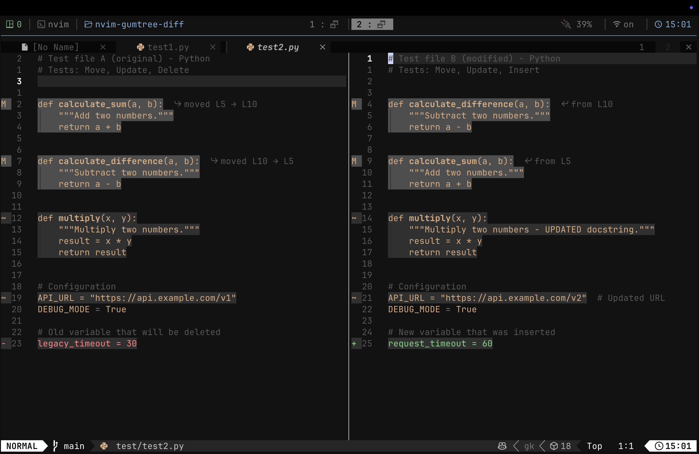
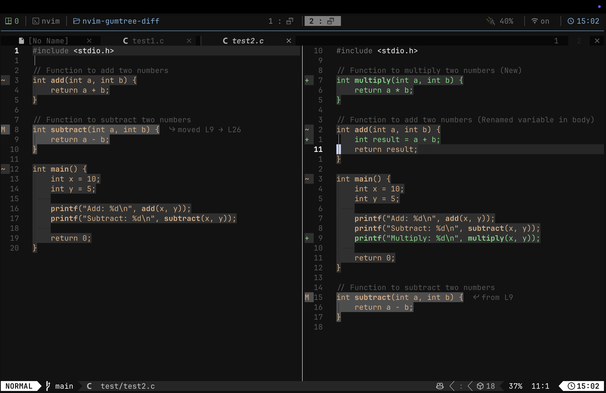
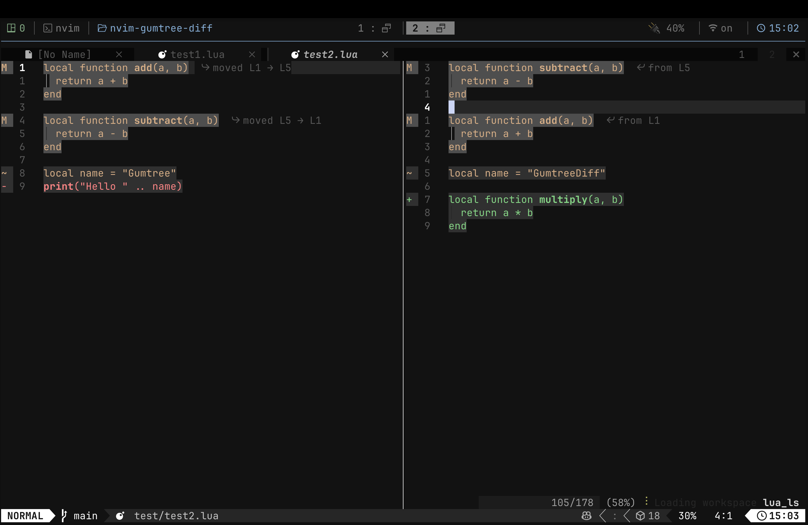

# nvim-gumtree-diff 🌳

> ⚠️ **This is a prototype!** Its still in early development and might have some bugs. Feel free to try it out tho!

A Neovim plugin that does semantic diffing using Treesitter and the Gumtree algorithm. Instead of just comparing lines like regular diff, this plugin actually understands the code structure and can detect things like moved functions, renamed variables, and updated code blocks.

## Why tho?

Regular diffs (like `git diff` or Neovim's builtin `:diffthis`) just compare lines. They dont understand that you moved a function from the top of the file to the bottom. This plugin uses AST matching to figure out what actually changed in your code.

For example if you move the `add()` function below `subtract()`, a normal diff would show it as deleted and re-added. But this plugin knows its the same function just moved!

## Features

- **Move detection** - Detects when code blocks are moved to a different location
- **Update detection** - Finds when code is modified in place
- **Insert/Delete detection** - Shows new and removed code
- Works and fully tested with Python, C, and Lua so far

## Screenshots

Here is the plugin working with different programming languages:

### Python


You can see its showing moved functions, updates, and stuff. This makes it easy to review the changes.

### C


Works with C code too! Its detecting the subtract function got moved and the main function has some updates.

### Lua  


Even works for Lua scripts. 

## Installation

Using [lazy.nvim](https://github.com/folke/lazy.nvim):

```lua
{
    "HarshK97/nvim-gumtree-diff",
    config = function()
        require("gumtree_diff").setup()
    end,
}
```

## Usage

To compare two files:

```vim
:GumtreeDiff path/to/file1 path/to/file2
```

Or if you have a file open already, just give one path and it will compare:

```vim
:GumtreeDiff path/to/other_file
```

It will open them side by side in a vsplit with the diff highlights.

## How it works

The plugin implements the Gumtree matching algorithm (kinda simplified version). Basically it does:

1. **Top-down matching** - Finds identical subtrees in both ASTs
2. **Bottom-up matching** - Matches parent nodes based on their mapped children
3. **Recovery matching** - Tries to find more matches for nodes that wasnt matched yet

Then it generates edit actions (move, update, insert, delete) and highlights them in the buffer.

## Requirements

- Neovim 0.9+ (needs Treesitter)
- Treesitter parsers for the languages you want to diff

## Known Issues

- Sometimes matching isnt perfect for really big files
- Some edge cases with nested functions might not highlight correctly

## Benchmarks

I ran some ai generated benchmarks to see how fast the plugin is with different file sizes. Results are from my MacBook (M4 Air chip). Your results might be different but it should give you a idea of performance.

| Test | Lines | TopDown (ms) | BottomUp (ms) | Recovery (ms) | Actions (ms) | Total (ms) |
|------|-------|--------------|---------------|---------------|--------------|------------|
| ~100 lines | 94 | 4.70 | 0.38 | 2.40 | 0.73 | **8.21** |
| ~250 lines | 229 | 7.99 | 1.66 | 8.15 | 4.31 | **22.11** |
| ~500 lines | 454 | 17.86 | 6.74 | 28.40 | 18.43 | **71.44** |
| ~750 lines | 679 | 28.12 | 18.03 | 50.55 | 45.41 | **142.11** |
| ~1000 lines | 904 | 38.76 | 30.36 | 83.08 | 87.80 | **240.00** |

It takes around 240ms for 1000 lines which is pretty fast for most use cases. The recovery phase takes the longest time right now, maybe I can optimize it later.

### Running the Benchmark Yourself

If you want to run the benchmark on your machine, you can do:

```bash
nvim --headless -c "lua dofile('test/benchmark.lua')"
```

Then check the results in `/tmp/gumtree_benchmark.txt`:

```bash
cat /tmp/gumtree_benchmark.txt
```

The benchmark generates synthetic Lua files with different sizes and measures how long each phase of the algorithm takes.

## License

MIT License - do whatever you want with it basically.

---

Made with ❤️ for the Neovim community
